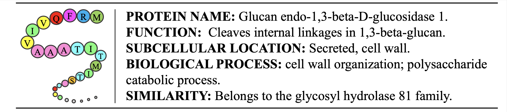
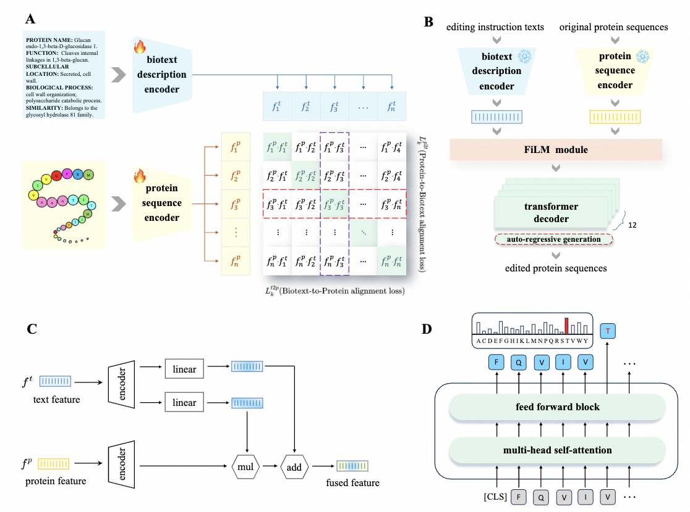
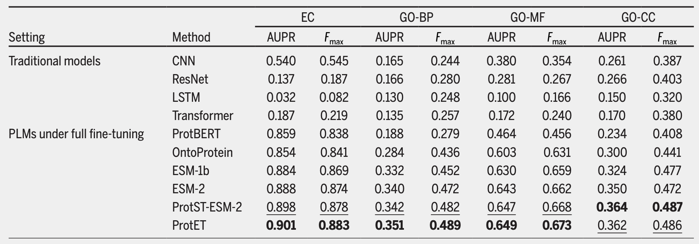

# ProtET: Multi-Modal CLIP-Informed Protein Editing
The repository is an official code implementation of [Multi-Modal CLIP-Informed Protein Editing](https://arxiv.org/abs/2407.19296), published in Health Data Science, a Science Partner Journal. 

 
Figure 1: Multi-Modal Learning of Protein and Biotext.
  
## Abstract
**Background:** Proteins govern most biological functions essential for life, and achieving controllable protein editing has made great advances in probing natural systems, creating therapeutic conjugates and generating novel protein constructs. Recently, machine learning-assisted protein editing (MLPE) has shown promise in accelerating optimization cycles and reducing experimental workloads. However, current methods struggle with the vast combinatorial space of potential protein edits and cannot explicitly conduct protein editing using biotext instructions, limiting their interactivity with human feedback. **Methods:** To fill these gaps, we propose a novel method called ProtET for efficient CLIP-informed protein editing through multi-modality learning. Our approach comprises two stages: in the pretraining stage, contrastive learning aligns protein-biotext representations encoded by two large language models (LLMs), respectively. Subsequently, during the protein editing stage, the fused features from editing instruction texts and original protein sequences serve as the final editing condition for generating target protein sequences. **Results:** Comprehensive experiments demonstrated the superiority of ProtET in editing proteins to enhance human-expected functionality across multiple attribute domains, including enzyme catalytic activity, protein stability and antibody specific binding ability. And ProtET improves the state-of-the-art results by a large margin, leading to significant stability improvements of 16.67% and 16.90%. **Conclusions:** This capability positions ProtET to advance real-world artificial protein editing, potentially addressing unmet academic, industrial, and clinical needs.

## Overview
ProtET is a multi-modality deep learning model that hybridly encodes biological languages and natural languages, and then executes cross-modal generation to achieve controllable protein editing. 
To accomplish this, we first curate millions of protein-biotext aligned pairs, each comprising protein sequences and functional biotext annotations, as illustrated in Figure 2. The large-scale multi-modal dataset consists of 570,420 proteins with manually reviewed property annotations and 251,131,639 proteins with computationally analyzed annotations. We then construct transformer-structured encoder-based models (*i.e.*, a large protein model with 650 million trainable parameters and a large language model with 100 million trainable parameters) to encode the features of both protein sequences and biotexts, respectively. Additionally, a hierarchical training paradigm is proposed to alleviate the challenge of cross-modal protein editing. During the pretraining stage, similar to CLIP, our multi-modality pretraining is performed using contrastive learning objectives to align the features of the protein and biotext, facilitating easier editing instruction. In the editing stage, the aligned protein features and desired function description features extracted by the pretrained models are fused by the introduced FiLM module. And we construct a generative decoder model to design the desired protein sequences in an auto-regressive manner. ProtET innovatively introduces a novel protein editing paradigm through multi-modal pretraining and cross-modal generation. Its controllable protein editing capability to enhance human-expected functionality demonstrates the great potential for clinical applications, such as vaccine development and genetic therapy, etc.

 
Figure 2: Overview of ProtET framework.

## Implement details
The overall framework are trained with a batch size of 128 for 10 epochs, utilizing 16 NVIDIA 32G V100 GPUs. The learning rate is initialized as $5.0 \times 10^{-5}$ with 2,000 linear warm-up steps.

## Environment installation
### Create a virtual environment
```
conda create -n ProtET python=3.10
conda activate ProtET
```
### Install Packages
```
pip install -r requirements.txt
```

## Pretraining Dataset & Model Checkpoint


| Pretraining Data : [protein-biotext dataset](https://zenodo.org/records/15242494/files/protein-biotext%20dataset.json.zip?download=1) |


| ProtET : [config](https://github.com/KDurant-123/ProtET/blob/main/config.json) & [ckpt](https://zenodo.org/records/15242494/files/model.safetensors?download=1) |


## Downstream tasks

ProtET achieves promising performance on the established protein editing tasks and demonstrates state-of-the-art function classification performance across multiple attribute domains at the time of release (including enzyme catalytic activity, protein stability, and antibody-specific binding ability). This is primarily attributed to the innovative hierarchical training paradigm, incorporating a multi-modal pretraining phase and a cross-modal generation phase. Furthermore, the evaluation performance highlights ProtET as a valuable tool for future controllable protein discovery and optimization endeavors in real-world scenarios.

 
Table 1: Thorough performance evaluation results.

## Citation
If you find this research work interesting and helpful, please cite our paper:
```
@article{yin2024multi,
  title={Multi-Modal Clip-Informed Protein Editing},
  author={Yin, Mingze and Zhou, Hanjing and Zhu, Yiheng and Lin, Miao and Wu, Yixuan and Wu, Jialu and Xu, Hongxia and Hsieh, Chang-Yu and Hou, Tingjun and Chen, Jintai and Wu, Jian},
  journal={Health Data Science},
  year={2024},
  publisher={AAAS}
}
```


